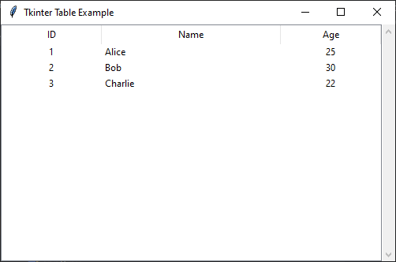

Tkinter does not have a built-in `Table` widget, but you can use the `ttk.Treeview` widget to create a table-like structure. If you need more advanced table functionality, you can use libraries like **pandas with Tkinter**, `tkintertable`, or `ttk.Treeview`.

---

### **Creating a Simple Table Using `ttk.Treeview`**
Here’s an example of how to create a table using `ttk.Treeview`:

```python
import tkinter as tk
from tkinter import ttk

# Create the main application window
root = tk.Tk()
root.title("Tkinter Table Example")
root.geometry("500x300")

# Define columns
columns = ("ID", "Name", "Age")

# Create a Treeview widget
tree = ttk.Treeview(root, columns=columns, show="headings")

# Define headings
tree.heading("ID", text="ID")
tree.heading("Name", text="Name")
tree.heading("Age", text="Age")

# Define column widths
tree.column("ID", width=50, anchor=tk.CENTER)
tree.column("Name", width=150, anchor=tk.W)
tree.column("Age", width=50, anchor=tk.CENTER)

# Add sample data
data = [
    (1, "Alice", 25),
    (2, "Bob", 30),
    (3, "Charlie", 22),
]

for row in data:
    tree.insert("", tk.END, values=row)

# Add scrollbar
scrollbar = ttk.Scrollbar(root, orient="vertical", command=tree.yview)
tree.configure(yscroll=scrollbar.set)

# Pack the widgets
tree.pack(fill=tk.BOTH, expand=True, side=tk.LEFT)
scrollbar.pack(fill=tk.Y, side=tk.RIGHT)

# Run the Tkinter event loop
root.mainloop()
```

---

### **Key Features in the Code:**
✅ Uses `ttk.Treeview` to display tabular data.  
✅ Adds column headings and sets their widths.  
✅ Inserts sample data dynamically.  
✅ Includes a scrollbar for better navigation.

Would you like to add extra features such as **editable cells, row selection, or data export**? 🚀


